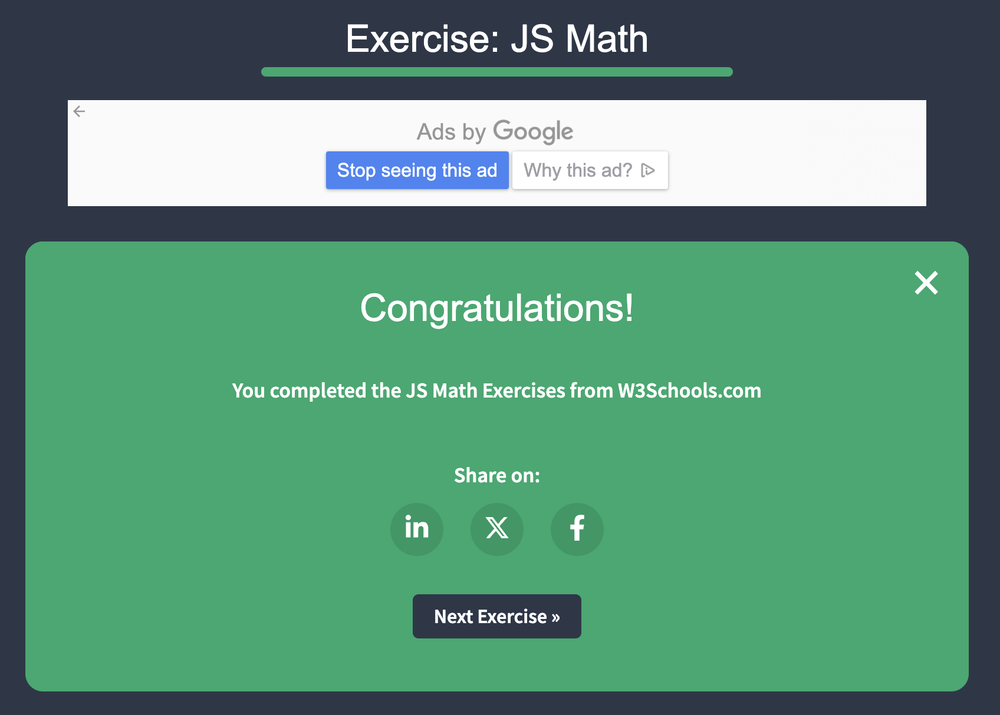

Good Morning!

For the first 10 minutes of class let's do the JS W3Schools Exercises.

- Do Introduction - Functions

- Screenshot when you complete an exercise

- Place all images on an .md file and push to class repository

