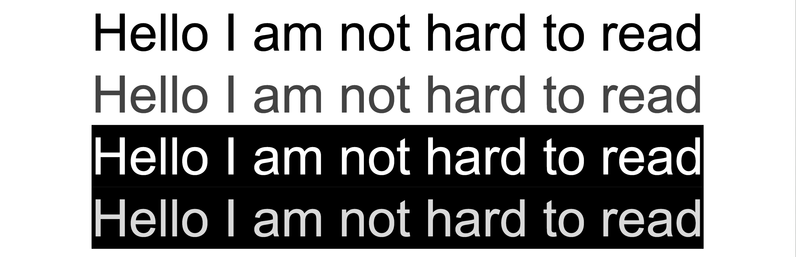
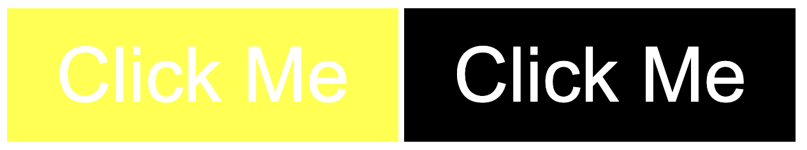
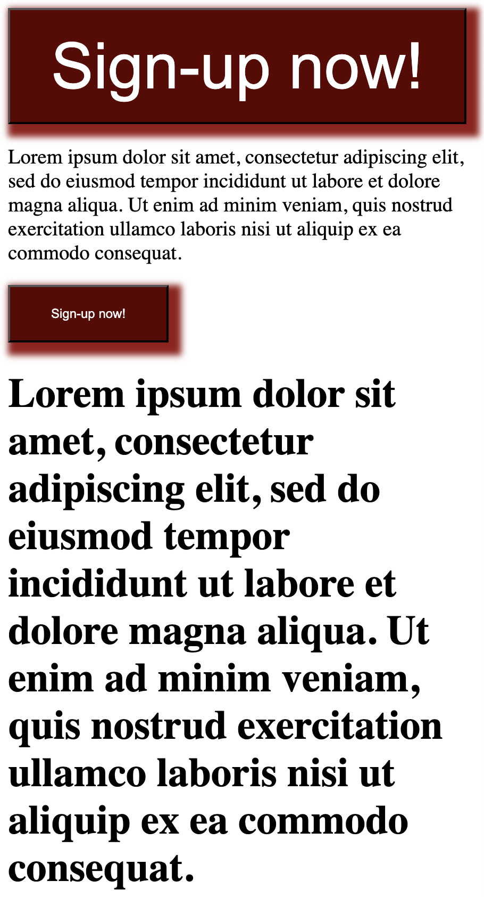

# Design Basics for Developers

### Learning Objectives

- Recognize and apply core UI design principles (contrast, hierarchy, typography, etc.).

- Understand the importance of designing with users in mind (user-centered design).

- Learn how to interpret a design brief and communicate effectively with designers.

- Begin to spot and name common design patterns.

> ### What do you think makes a website ‘well-designed’?

## Core UI Principles

Today, we’re not turning you into full-time designers, but we are going to give you the tools to spot what makes an interface clear, usable, and intentional.

These core principles are your cheat codes to making things look good and feel better.

### Visual Design Principles

#### Contrast

> **What does it mean?**

Using differences in color, shape, size, or font weight to draw attention or create separation.

> **Why does it matter?**

Helps users know what to focus on.

Examples:

High contrast: Dark text on white background.

> Instead of always using black text, you can occasionally use `dark` gray text on a white background, which makes the change in brightness less drastic. This prevents over-stimulation of the retina and allows users to read for longer periods of time.‍

_Personally_ I prefer dark mode aka white text on black background. Dark mode is something you can consider adding to your website for accessibility purposes as well.

Low contrast: Light gray text on a white background = unreadable.

#### Which button is easier to read?

### Typography

**What it means**:

How text is styled, including size, weight, spacing, and font choice.

**Why it matters**:

Text is 95% of the web. If it’s ugly or hard to read, everything breaks down.

[5 tips for perfect typography](https://www.uxtoast.com/design-tips/5-tips-for-perfect-typography)

### Quick rules:

- Don’t use more than 2–3 typefaces.
  

- Use proper size hierarchy (headings should feel like headings).

- Line length: keep it 50–75 characters.

### Visual Hierarchy

**What it means**:

Guiding the user’s eye using size, color, and position.

**Why it matters**:

People scan before they read. You can tell them what to see first.

### Alignment & Grids

**What it means**:

Arranging elements along invisible lines or grids.

**Why it matters**:

Messy layouts feel unprofessional. Clean alignment = clarity.

### Whitespace

**What it means**:

Empty space between elements.

**Why it matters**:

It’s not wasted, it gives breathing room, makes things scannable, and helps focus.

### Color (Basic Theory)

**What it means**:

Using color purposefully, not randomly.

[How to strategically use color in website design](https://www.flux-academy.com/blog/how-to-strategically-use-color-in-website-design)

### Quick hits:

- Use color to signify meaning (e.g., red = danger, green = success).

- Stick to 1–2 main colors with 1 accent.

- Use a color contrast checker.

[Adobe Color Wheel](https://color.adobe.com/create/color-wheel)

### Images and Icons

#### Tips:

- Use high-quality, consistent images.

- Don’t mix photo styles (e.g., flat icons with 3D photos).

- SVGs are great for crispness.

[Tips on how to pick the right icons for your website.](https://stephaniewalter.design/blog/tips-on-how-to-pick-the-right-icons-for-your-website-with-icons8/)

> You don’t need to memorize all this—just build the habit of asking: Does this feel readable? Does this guide the user? Is this intentional?

### Activity: “Fix This Page!”

In pairs or small groups, revise the CSS on the [FixThisPage.html](./FixThisPage.html) file to improve contrast, spacing, typography, etc.

[Bad Website Examples](https://sage.agency/blog/bad-websites/)

[Award-winning websites in 2023](https://business.adobe.com/blog/basics/best-website-design-examples)

# User-Centered Design

As devs, we love to solve puzzles. But the user doesn’t care how elegant our code is—they care that they can buy the thing, read the info, or log in without getting stuck.

### Key Concepts

### 1. You Are Not the User

**_Just because you know where to click doesn’t mean your user does._**

We make assumptions because we’re close to the product.

Real users click on the wrong thing, get confused, and leave.

> “Design is not just what it looks like and feels like. Design is how it works.” — Steve Jobs

### 2. Design for Accessibility

_Designing for everyone helps everyone._

Examples:

- Colorblind users? Don’t rely only on color to communicate.

- Screen reader users? Use proper semantic HTML.

- Motor impairments? Make buttons big enough to tap.

Use [Color Contrast Checker](https://colourcontrast.cc/) tools.

### 3. User Research & Testing (Very Basics)

Watch a friend use your site.

_Where do they hesitate? What do they click first?_

Don’t lead them. Just observe.

### 4. Common Design Patterns

These are solutions people already understand. Use them instead of reinventing the wheel.

- Cards (for blog posts or product listings)

  - Image + title + brief text

  - Clickable area

  - Often responsive

  - Grid or list view

- Modal dialogs (for pop-ups)

  - Dimmed background

  - Focused user interaction

  - Dismiss/cancel action clearly available

- Breadcrumbs (for navigation)

  - Shows hierarchy

  - Each section clickable

  - Helps users backtrack

- Lazy loading (especially for images)

  - Faster initial page load

  - Placeholder graphics

  - Improves perceived performance

- Infinite scroll vs pagination

  - Infinite scroll: Great for casual browsing

  - Pagination: Better for goal-oriented searching

- Forms with progress indicators

  - Shows user how far they’ve come

  - Prevents form fatigue

  - Reduces anxiety about completion time

### 5. Inclusive Design

Think about varied experiences and needs from the beginning, not as an afterthought.

Ask yourself “Can everyone use this?” Not just “Does it work on my laptop?”

> ### What’s one thing you’ll bring into your final?

---

    If you’re building the house, you should know how people will live in it.

    Even if you’re not picking the wallpaper, you need to make sure the doors aren’t upside down.

---

### What’s a Design Brief?

A design brief is a short document or conversation that outlines:

- The problem to solve

- The target audience

- The project goals

- Any known constraints (tech stack, timeline, accessibility, branding)

- Deliverables

### Why It Matters for Developers

You’ll often build from a brief.

Good devs ask good questions. The brief is where you start.

#### Understanding why things are designed helps with:

- Accessibility choices

- Responsive behavior

- Technical feasibility

- Making useful suggestions

_Think of a time when something you built or coded didn’t quite make sense to you... maybe you didn’t know why it was supposed to be that way._

**_That’s a clue the brief wasn’t clear (or was missing altogether)._**

### Example Design Brief (thank you AI):

#### <ins>Local Library Mobile Website</ins>

**Project Title**:

Mobile-Friendly Website for Brooklyn Neighborhood Library

**Background**:

The Brooklyn Neighborhood Library is a small local branch that wants to modernize its digital presence. Right now, their website only works well on desktop, and it’s hard to navigate from a phone. They're getting complaints from younger patrons and parents who primarily use mobile.

**Goal**:

Design a mobile-first homepage and book search experience that makes it easy for users to:

- Find hours and location info

- Search for books

- View upcoming events

- Log into their library account

Target Users:

- Parents with kids (on-the-go, using phones)

- Students (high school & college)

- Seniors (less tech-savvy, need clarity)

Requirements:

- Must follow the library’s existing color scheme: navy, cream, and gold

- Should be usable on mobile and tablets

- Use large, clear buttons and legible text

- Include search prominently

- Event info should be easy to find

Nice-to-Haves:

- Dark mode

- Language toggle (English/Spanish)

**Group Activity:**

1. Read the brief together.

2. What do you think the top priorities are?

3. What questions would you ask the designer or client?

4. Sketch a wireframe for the mobile homepage on the whiteboards.

5. Choose one feature (search bar, event list, login, etc.) and make it more detailed.
