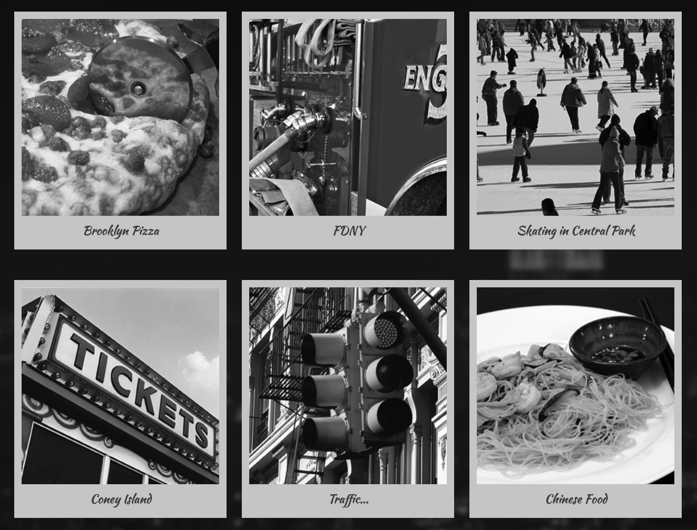

## Homework Due March 3rd

### Checklist

1. **Challenge**

   [ ] Complete the [MDN Web Docs Box Model Challenge](https://developer.mozilla.org/en-US/docs/Learn_web_development/Core/Styling_basics/Box_Model_Tasks)

2. **Gallery Site**

   [ ] Style the Gallery Starter file

### Details

#### Challenge

- Complete the [MDN Web Docs Box Model Challenge](https://developer.mozilla.org/en-US/docs/Learn_web_development/Core/Styling_basics/Box_Model_Tasks)
- Upload the `.html` (and `.css` if external) to this weeks HW folder in your repository.

---

#### Gallery Site

Review the NYC Gallery folder and see how the style.css page is setup.

Download the Gallery Starter File and add it to your GitHub page (username.github.io repository).

Style the gallery in your own way.

> Examples:
>
> - Add your own images
> - Different font
> - Change the colors and background images
> - Add a navigation bar

Anything you want to change, as long it utilizes what we learned in class.

Be creative and have fun!

## Homework Due February 27th

### Checklist

1. **Linking and Servers**

   [ ] Create a GitHub Page Repository

   [ ] Your first hosted site!

2. **Exploring Websites as Art**

   [ ] Read the article [Agents Of Change: The Internet.](https://magazine.artland.com/agents-of-change-internet-net-art-how-the-world-wide-web-has-affected-the-way-we-make-art/)

   [ ] Browse [Rhizome's Net Art Anthology](https://anthology.rhizome.org/)

   [ ] .md file about which artworks resonated with you

### Details

#### Your first hosted site

- Use the [GitHub Pages](https://pages.github.com/) tutorial create a GitHub Hosted Page.
- Add your page (USERNAME.github.io) to the [class roster google sheet](https://docs.google.com/spreadsheets/d/1mypPKpLeb8K2L3tSgLmB0cUEQaopdfFvYwfKA70r1gQ/edit?usp=sharing).
- Create a site, using your _USERNAME.github.io repository_, that link to at least three different files.
- Use CSS to style your files.

> Example
>
> - Home
> - About
> - Contact

> [Example Sites](https://samdear.github.io/LinkingExample/)

_As long as you use what we've learned in class, feel free to take creative liberty with these assignments._

---

#### Exploring Websites as Art

Websites are not just functional tools; they can also be a form of artistic expression. In this assignment, you will explore the concept of net.art and reflect on how the internet can be a medium for creative expression.

Read the article [Agents Of Change: The Internet.](https://magazine.artland.com/agents-of-change-internet-net-art-how-the-world-wide-web-has-affected-the-way-we-make-art/) and look through [Rhizome's Net Art Anthology](https://anthology.rhizome.org/).

In a .md file share which works resonated with you and why.
